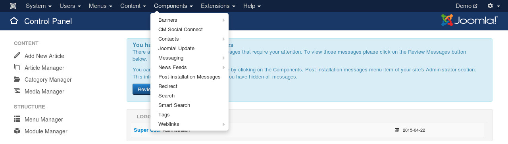
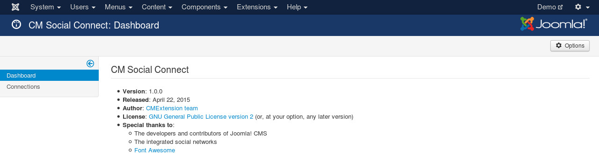
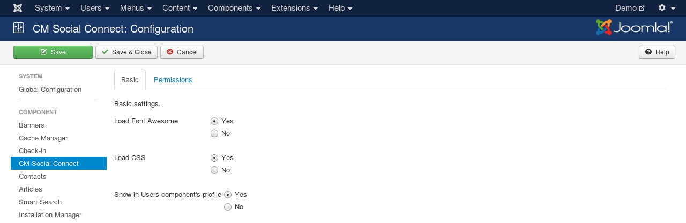

=========
Component
=========

After you install the package of CM Social Connect, you can find the component CM Social Connect in "Components" menu in your back-end.

By default you see the dashboard when you access the component.

To configure the component, you click the "Options" button on the right side of the toolbar.

There are 3 options:

* **Load Font Awesome**: CM Social Connect requires Font Awesome. If Font Awesome is already loaded by another extension (for example, your template), you set this option to "No", otherwise you should set to "Yes".
* **Load CSS**: Load CSS of CM Social Connect which contains some styles for login and register buttons to make them more beautiful. If you don't load CSS, your template CSS will be used.
* **Show in Users component's profile**: Show connection info in Users component's profile view and connect/disconnect options in Users component's profile form.