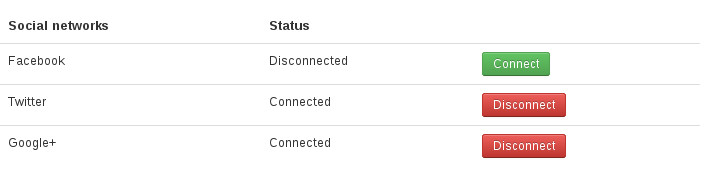

==================
Manage connections
==================

Administrators
--------------

In your Joomla! back-end, you can see the list of connections of users to social networks.

You can select specific connections and click "Delete" button to delete them.

Registered users
----------------

If you set "Show in Users component's profile" option in the component's configuration to "Yes", user can see his connected social networks in his profile

When editing his profile, user can connect to new social networks or remove connections for connected social networks.

After connecting to a new social network, he can log into the site by using this new social network's account. If remove a connection, he can't login with this social network any more.

If you don't want to display social network info in user profile but still want to give your users ability to manage their connections, you can create a menu item for "User's connections" from CM Social Connect component.

