===================
Google+ integration
===================

To support Google login, you need to have a Google Developers project.

Go to `https://console.developers.google.com/ <https://console.developers.google.com/>`_, click "Create Project" button to create a new project.

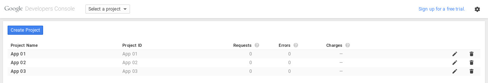

Give your project a name.

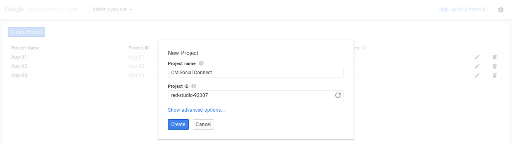

After your project is created, on the left menu you go to APIs & auth -> Credentials, click "Create new Client ID button".

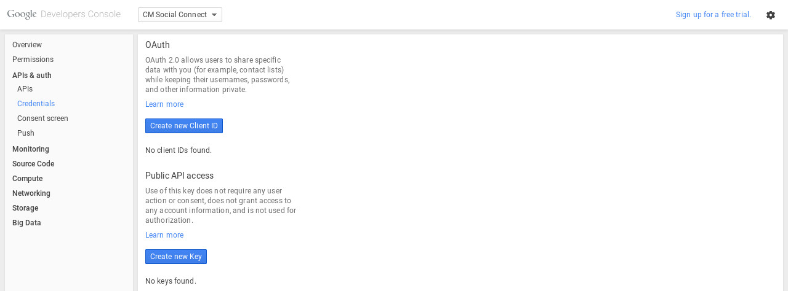

Select "Web application" as "Application type".

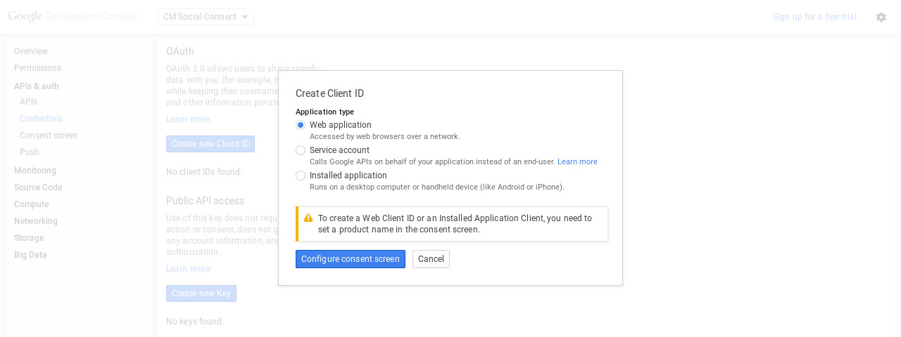

Select an email address and enter product name.

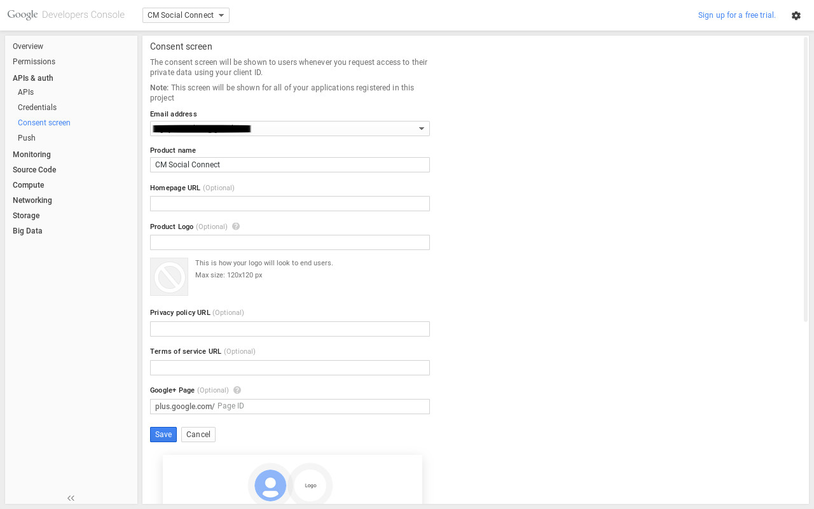

Enter your site URL in "Authorized JavaScript origins" option. For "Authorized redirects URIs" option you need to enter 3 URLs::

	http://yoursite.com/index.php?option=com_cmsocialconnect&task=registration.socialRegister&network=googleplus
	http://yoursite.com/index.php?option=com_cmsocialconnect&task=login.socialLogin&network=googleplus
	http://yoursite.com/index.php?option=com_cmsocialconnect&task=connect.socialConnect&network=googleplus

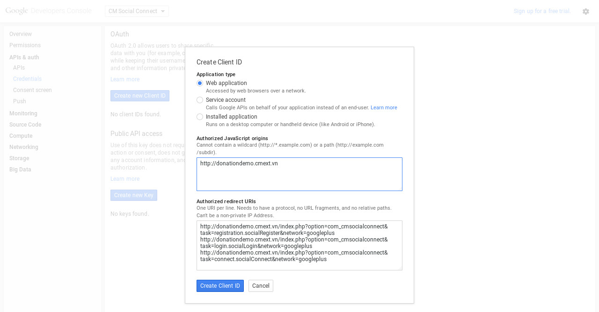

Click "Create Client ID", you can find your client ID and client secret in APIs & auth -> Credentials.

In your back-end, go to Extensions -> Plugin Manager, search for "CM Social Connect - Google+ integration" plugin.

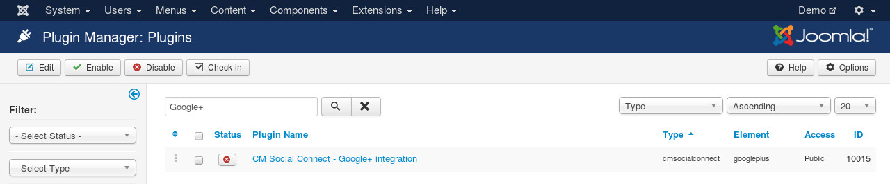

Edit the plugin, you set "Status" to "Enabled", enter the client ID and client secret of your project.

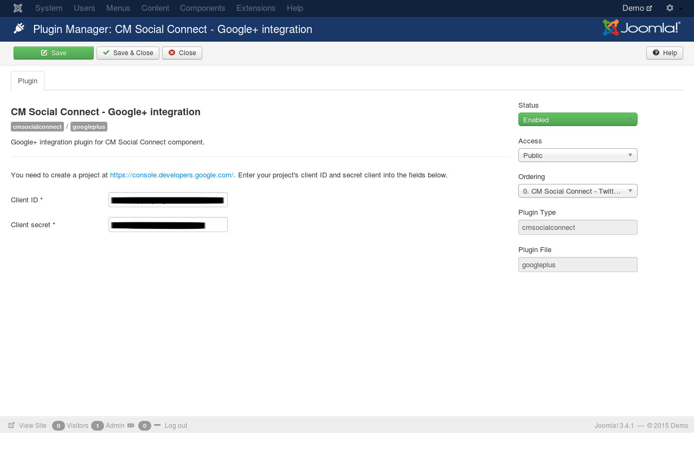

Save the plugin. Go to your site's front-end, now you can see the Google+ icons in registration form, login form and login module.

Login form:

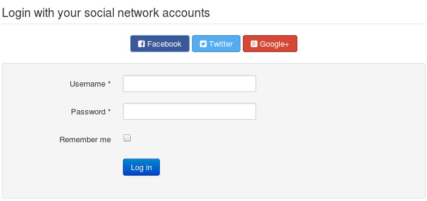

Registration form:

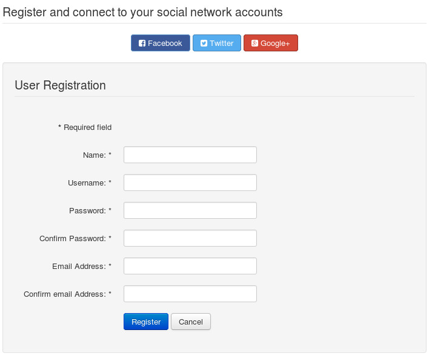

Login module:

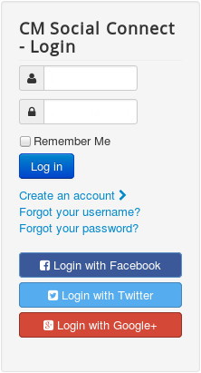