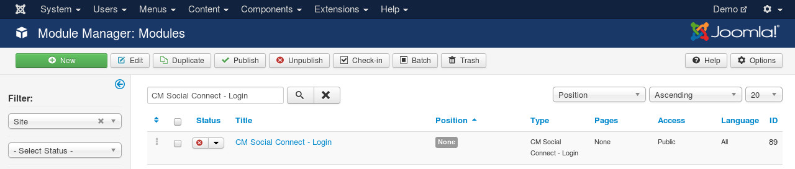
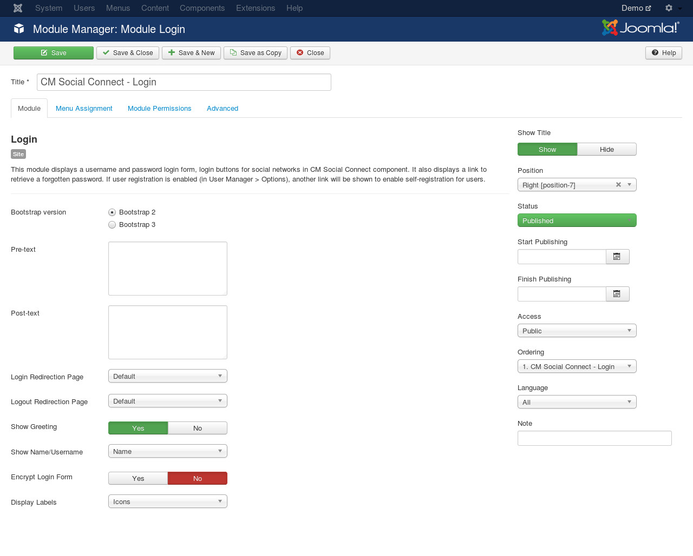

============
Login module
============

Joomla! already has a login module, because we can not add login buttons to this module automatically, we buil copyied Joomla! login module to a new module called "CM Social Connect - Login". This module works the same way as Joomla! login module, there are only 2 differences:

* CM Social Connect's login module has a layout for Bootstrap 3. If you use a Bootstrap 3 template, you don't need to override the module's layout to convert its HTML to Bootstrap 3.
* CM Social Connect's login module has social login buttons at the bottom.

When you install the package of CM Social Connect, CM Social Connect login module is also installed and created. In your back-end, you go to Extensions -> Module Manager, look for "CM Social Connect - Login".

Edit the module, you can see it has the same options of Joomla! login module, there is a new option "Bootstrap version" for selecting what Bootstrap version is used in the module.

If you publish the module on your front-end and you haven't configured any social networks yet, then you will not see social login buttons, it just looks like Joomla! login module.