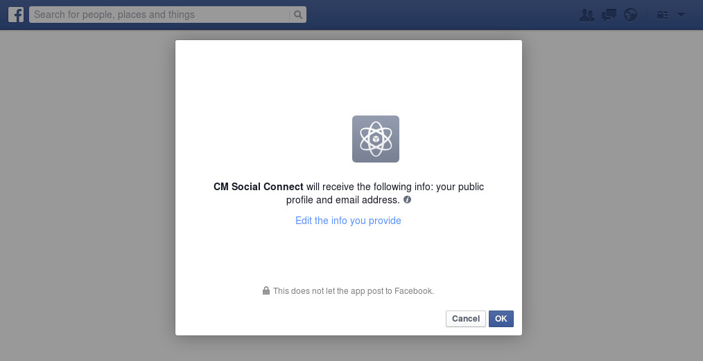
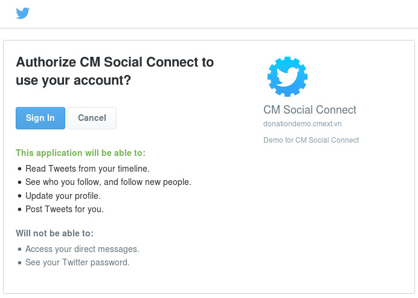
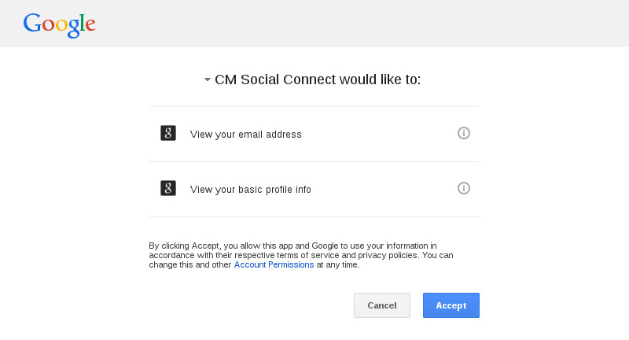
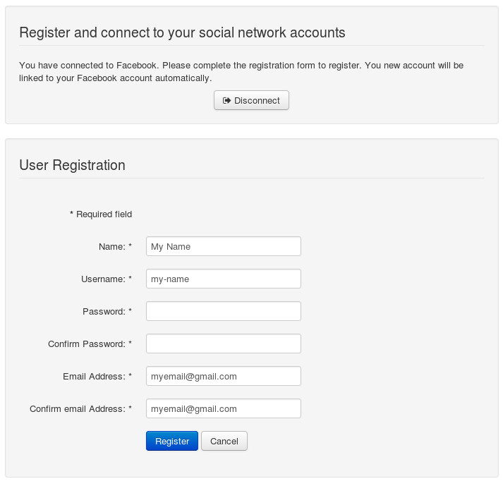

============
Registration
============

In registration form of Users component, there are social network buttons, you need to click to connect to one of these social networks before registering a new Joomla! account.

.. image:: ../images/googleplus_config_registration.jpg

After clicking one of the social network buttons, you are taken to this social network to authorize.

Facebook:

Twitter:

Google+:

After authorizing, you are taken back to the registration form, the form could look similar to this:

Your information like in the selected social network are filled into the form automatically, you can change them if you want. After proving missing information like password, you register as usual. If your registration is successful, you are logged in automatically and your new Joomla! account is connected to the selected social network, you can now login with this social network account.

**Note**:

* Username is generated automatically from your information on the connected social network.
* Twitter doesn't provide email address of user, so if you connect to Twitter you will see empty email address fields in the registration form.
