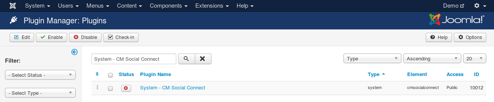

=============
System plugin
=============

In your back-end, go to Extensions -> Plugin Manager, search for "System - CM Social Connect".

This plugin is used to add social registration and login buttons to Registration and Login pages of Users component of Joomla!. This plugin doesn't have any option, you just need to enable it.