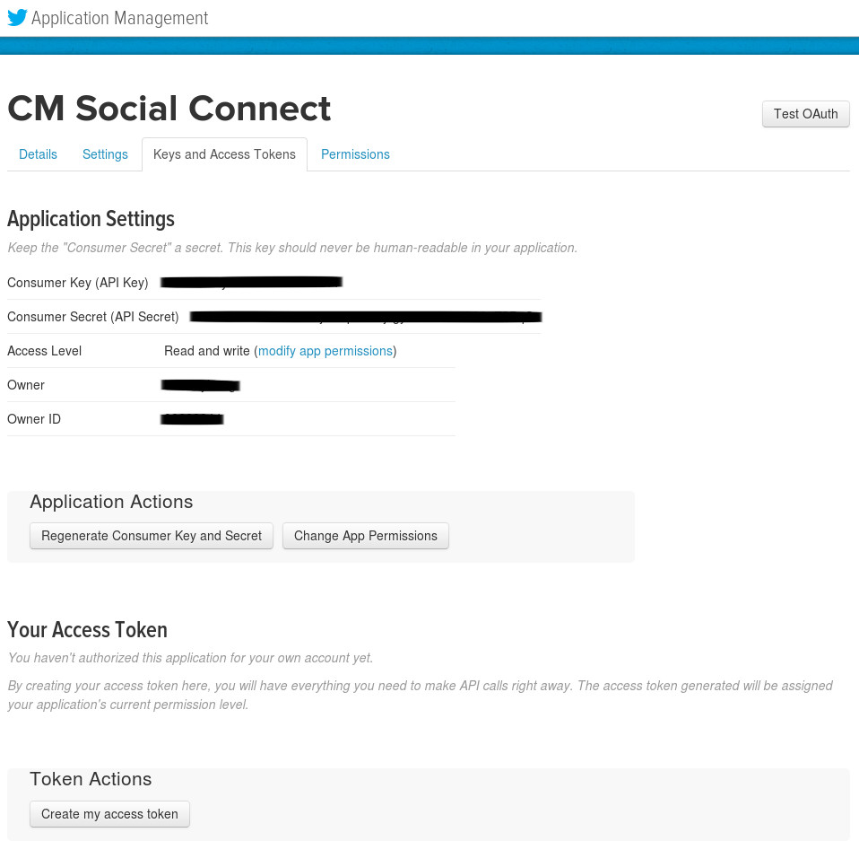

===================
Twitter integration
===================

To integrate with Twitter, you go to `https://apps.twitter.com/ <https://apps.twitter.com/>`_ to create an application.

Click "Create New App".

Provide the required information. Ensure you also enter your site URL in Callback URL field, otherwise callback will be disabled and you will get error when connecting to Twitter.

After your app is created, click "Keys and Access Tokens" tab to get API key and API secret.

Consumer key (or API key), consumer secret (API key) are the values you need to enter in your Twitter Joomla! plugin.

In your back-end, go to Extensions -> Plugin Manager, search for "CM Social Connect - Twitter integration" plugin.

Edit the plugin, you set "Status" to "Enabled", enter the API key and API secret of your Twitter application.

Save the plugin. Go to your site's front-end, now you can see the Twitter icons in registration form, login form and login module.

Login form:

Registration form:

Login module:

