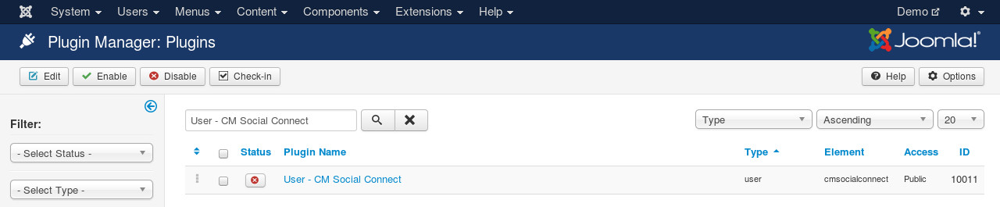

===========
User plugin
===========

In your back-end, go to Extensions -> Plugin Manager, search for "User - CM Social Connect".

This plugin is used to integrate with Users component of Joomla!. This plugin doesn't have any option, you just need to enable it.